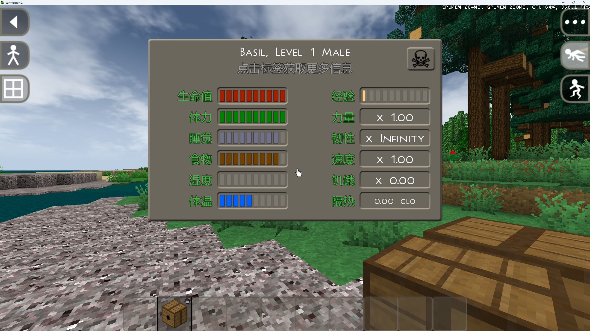
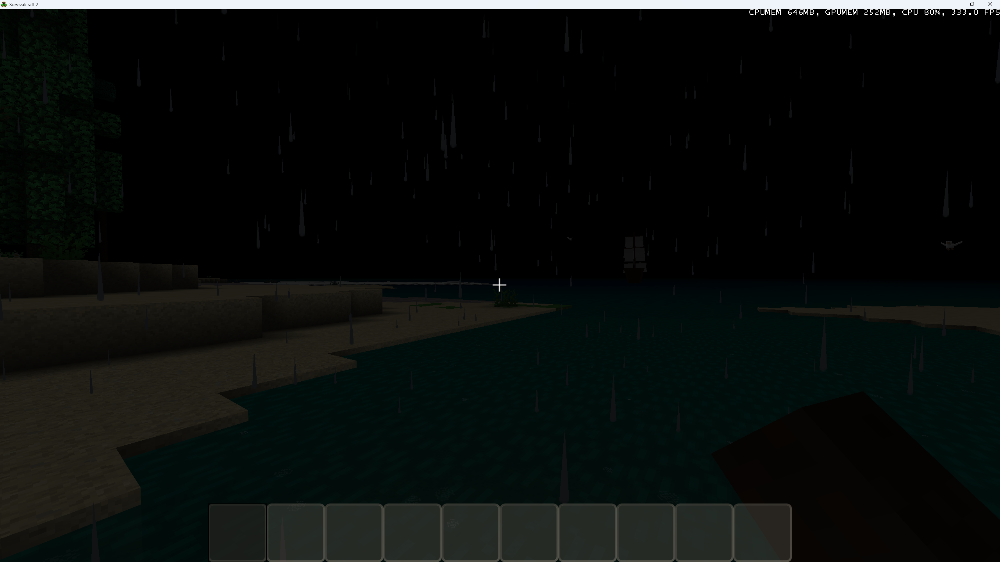
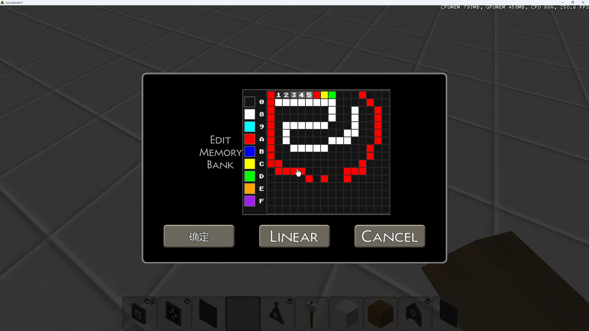

# SuAPI Example Mod Set

Survivalcraft 2 SuAPI Mod 示例集合。

## 同步控制

通过 `SYNC_LIST` 文件控制哪些 Mod 文件夹被 Git 同步：

```
# SYNC_LIST 格式：每行一个文件夹名
ConsoleMod
```

- 列出的文件夹 → 同步到仓库
- 未列出的文件夹 → 不同步
- 文件夹内的 `bin/`、`obj/`、`.vs/` 自动排除

**添加新 Mod 同步**：编辑 `SYNC_LIST`，添加文件夹名，然后运行：

```powershell
pwsh sync-gitignore.ps1
```

## 已收录 Mod

所有 Mod 已迁移至 net10.0 双平台（Android + Windows），使用 SDK 样式 csproj。

### SurvivalcraftMiniMap


小地图 Mod，通过新建 ComponentTemplate 向 Player 挂载地图组件，实时显示玩家位置和周围地形。

### ConsoleMod


游戏内控制台，按 `·` 打开，支持 `move +x300` 等指令移动角色，Widget Overlay 模式不暂停游戏。双平台支持：Windows 端用 `KeyboardInput` 内联输入 + 鼠标解锁；Android 端用 `Keyboard.ShowKeyboard()` 对话框输入。`#if WINDOWS` 条件编译示例。

### StringInterceptor



字符串翻译 Mod，通过 Widget 树文本拦截 + IStringProcessor 翻译接口，将游戏界面翻译为中文。支持 .lst 字体加载、动态译文收集、XML 翻译表导出。演示 `LoadingManager.QueueItem` 和 `LoadingManager.ReplaceItem` 的 MAUI net10.0 用法。

### RainWithoutDawn



Subsystem 替换天气系统，移除下雨逻辑。简洁的 Subsystem 替换模式参考范例。

### MemoryBankDrawMod



Memory Bank 绘图编辑器 Mod，替换 `SubsystemMemoryBankBlockBehavior`，用自定义 Dialog 在原始 Linear/Grid 视图基础上增加 Draw 模式——16×16 像素绘图网格，支持 16 色画笔和拖拽填充。演示 Dialog 替换模式、TextBoxWidget 反射、ClickableWidget 叠加层架构。

### ScMultiplayer

多人联机 Mod，基于 Comms 通信库。演示复杂 Mod 示例：
- **ModInfo.xml Dependencies 声明**：Comms.dll 必须在 `<Dependencies>` 中声明，否则 ModLoader 不加载导致 `ReflectionTypeLoadException`
- **LoadingManager.ReplaceItem**：替换 Play 屏幕注册，name 精确匹配 QueueItem 注册名（"Initialize PlayScreen"）
- **UdpTransmitter 构造函数变更**：MAUI 版 `UdpTransmitter(int localPort = 0)`，自动检测 LAN 地址
- **条件编译**：`#if WINDOWS` 包裹 KeyboardInput 专属 API

### 其他 Mod

| Mod | 类型 | 说明 |
|-----|------|------|
| TemperatureImmunity | Component 替换 | 替换体温组件，保持恒温 |
| Comms | 联机通信库 | SuAPI 联机 Mod 通信基础库，ScMultiplayer 依赖 |

## 运行时铁律

1. **ModLoader 依赖加载**：.scmod 内 DLL 不会自动全部加载，只有与 Identifier 同名的和 `<Dependencies>` 声明的才会被加载。未声明 → `ReflectionTypeLoadException`
2. **ReplaceItem name 匹配**：`LoadingManager.ReplaceItem(name, action)` 的 name 是 QueueItem 注册名（"Initialize PlayScreen"），不是 Screen 名（"Play"）
3. **EventBus 静默吞异常**：回调异常只写 `Console.WriteLine`，不记入 `Game.log`
4. **Release Android AOT/Linker 裁剪**：主程序未使用的方法会被 linker 移除，Mod 中使用→`MissingMethodException`（被 EventBus 吞掉→功能静默失效）。已被裁剪的方法：`HashSet.RemoveWhere`、`List.Sort(Comparison<T>)`、`XDocument.Load(string)`、`System.Threading.Timer` 等。Mod 只用最基础集合操作，避免 Linq/委托排序/params 构造函数
5. **SC 坐标系 Y 向上**：OpenGL 坐标系 Y 从下往上。定位参数不能耦合大小参数，必须拆分为 visualRadiusPx + marginX/Y
6. **禁止提交诊断 Log**：临时调试日志（`[SuAPI]`/`[Window]` 等）验证后必须移除，Android 上频繁日志=频繁磁盘 I/O
7. **Storage.ProcessPath**：只识别 `app:` 和 `data:` 协议，绝对路径抛异常。Android 写外部存储必须用 `FileStream`
8. **FileStream 日志**：必须用 `FileAccess.ReadWrite`，游戏内 `ViewGameLogDialog` 用 `StreamReader` 读取
9. **adb install**：PowerShell 中 `-t` 参数被解析为 PowerShell 参数，用 `adb install --user 0` 替代
10. **P/Invoke 同名函数**：user32.dll `LoadImage` 只有一个入口，用 `EntryPoint="LoadImage"` 重载
11. **GLFW 窗口图标**：不继承 exe 图标，需显式 `SendMessage(WM_SETICON)`，HWND 只在 LoadHandler 内可用
12. **MAUI 模板清理**：删除 appicon.svg/appiconfg.svg(.NET紫色)、splash.svg、dotnet_bot.png
13. **先用已有机制**：代码中已有 EmbeddedResource 声明或空占位时，必须先利用，禁止绕远路
14. **MAUI 移除 Logging.Debug**：MAUI 模板默认引入，Android logcat 大量输出导致卡顿

## 相关仓库

- SuAPI 核心：https://gitee.com/SC-SPM/survivalcraft-su-api

## AI Agent 技能

此仓库包含 AI Agent 技能配置 `SKILL.md` 和专家配置 `AGENT-PROFILE.md`，可导入 QClaw/OpenClaw 获得示例集管理助手。
触发词：「添加示例」「同步到示例」「example mod set」。