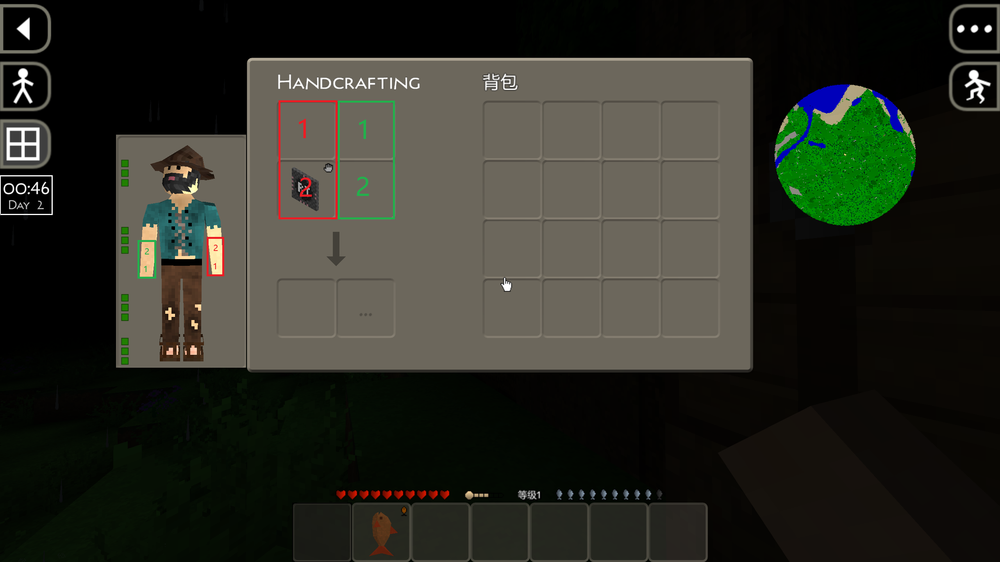

# SuAPI Example Mod Set

Survivalcraft 2 SuAPI Mod 示例集合，演示 SuAPI 接口的各种用法。

## 项目特性

- **net8.0** — 所有 Mod 基于 .NET 8.0，SDK 样式 csproj
- **SuAPI 接口** — 通过 IModEventBus / IModInjector / IModParentField / IModParentMethod / IModResource 调整游戏行为，不修改原始代码
- **IsMergeLib** — 支持 `IsMergeLib=true`（DLL 放 `Lib/`，双端共用）或 `false`（按平台放 `Lib/X64` + `Lib/Arm64`）
- **Python zipfile 打包** — .scmod 必须用 Python zipfile 打包，确保正斜杠路径

## 使用方法

### 编译 Mod

从项目根目录运行（global.json 锁定 SDK 8.0.402）：

```bash
# Windows
dotnet build Mod/<ModName>/<ModName>.csproj -c Debug --framework net8.0

# Android（需要 net8.0-android 工作负载）
dotnet build Mod/<ModName>/<ModName>.csproj -c Debug --framework net8.0-android
```

IsMergeLib=true 的 Mod 只需编译 Windows 版（单 TFM `net8.0`），DLL 双端共用。

### 打包 .scmod

```python
import zipfile, os

MOD_NAME = "YourMod"
MOD_DIR = r"D:\...\Mod\YourMod"
MODS_DIR = r"D:\...\publish\win-x64\Mods"

modinfo = os.path.join(MOD_DIR, "ModInfo.xml")
win_dll = os.path.join(MOD_DIR, "bin", "Debug", "net8.0", "Obfuscar", f"{MOD_NAME}.dll")

with zipfile.ZipFile(os.path.join(MODS_DIR, f"[SuAPI]你的Mod名.scmod"), 'w', zipfile.ZIP_DEFLATED) as zf:
    zf.write(modinfo, "ModInfo.xml")
    zf.write(win_dll, f"Lib/{MOD_NAME}.dll")          # IsMergeLib=true
    # zf.write(win_dll, f"Lib/X64/{MOD_NAME}.dll")     # IsMergeLib=false
    # zf.write(android_dll, f"Lib/Arm64/{MOD_NAME}.dll") # IsMergeLib=false
```

### 部署

将 .scmod 放入游戏 `Mods/` 目录即可加载。

### ModInfo.xml 格式

```xml
<?xml version="1.0" encoding="UTF-8"?>
<Mod>
    <ModInfo>
        <Identifier>YourMod</Identifier>
        <LocalizedName>
            <Text lang="en_US">Your Mod</Text>
            <Text lang="zh_CN">你的Mod</Text>
        </LocalizedName>
        <ModVersion>
            <Version>1.0.0</Version>
            <APIVersion>2.1.0</APIVersion>
        </ModVersion>
        <Asset>
            <ContentRoot>Content</ContentRoot>
        </Asset>
        <IsMergeLib>true</IsMergeLib>
    </ModInfo>
    <Dependencies>
        <!-- <Dependency><ModInfo><Identifier>Comms</Identifier></ModInfo></Dependency> -->
    </Dependencies>
</Mod>
```

## 已收录 Mod

### SurvivalcraftMiniMap


小地图 Mod，通过 ComponentTemplate 向 Player 挂载地图组件，实时显示玩家位置和周围地形。

### WatchMod



手表 Mod，ComponentTemplate+IUpdateable 独立组件模式，handcrafting slot 2 放置 RealTimeClockBlock 时显示游戏时间。不替换 SubsystemGameWidgets，与其他 UI Mod 兼容。

### ConsoleMod


游戏内控制台，按 `·` 打开，支持 `move +x300` 等指令。Windows 端用 KeyboardInput 内联输入，Android 端用 `Keyboard.ShowKeyboard()` 对话框输入。

### StringInterceptor


字符串翻译 Mod，Widget 树文本拦截 + IStringProcessor 翻译接口，将游戏界面翻译为中文。演示 `LoadingManager.QueueItem` 和 `ReplaceItem` 用法。

### RainWithoutDawn


Subsystem 替换天气系统，移除下雨逻辑。简洁的 Subsystem 替换范例。

### MemoryBankDrawMod


Memory Bank 绘图编辑器，替换 `SubsystemMemoryBankBlockBehavior`，增加 16×16 像素 Draw 模式，16 色画笔和拖拽填充。IsMergeLib=true，单 DLL 双端运行。

### ScMultiplayer

多人联机 Mod，基于 Comms 通信库。演示复杂 Mod：Dependencies 声明、LoadingManager.ReplaceItem、条件编译。

### 其他 Mod

| Mod | 类型 | 说明 |
|-----|------|------|
| TemperatureImmunity | Component 替换 | 替换体温组件，保持恒温 |
| Comms | 联机通信库 | SuAPI 联机 Mod 通信基础库，ScMultiplayer 依赖 |

## 运行时铁律

1. **ModLoader 依赖加载** — .scmod 内 DLL 不会自动全部加载，只有 Identifier 同名的和 `<Dependencies>` 声明的才会被加载
2. **ReplaceItem name 匹配** — `LoadingManager.ReplaceItem(name, action)` 的 name 是 QueueItem 注册名（"Initialize PlayScreen"），不是 Screen 名
3. **EventBus 静默吞异常** — 回调异常只写 Console.WriteLine，不记入 Game.log
4. **Release Android AOT/Linker 裁剪** — 主程序未使用的方法会被 linker 移除，Mod 使用→MissingMethodException。避免 Linq/委托排序/params 构造函数
5. **SC 坐标系 Y 向上** — 定位参数不能耦合大小参数，必须拆分为 visualRadiusPx + marginX/Y
6. **禁止提交诊断 Log** — 临时调试日志验证后必须移除
7. **Storage.ProcessPath** — 只识别 `app:` 和 `data:` 协议，绝对路径抛异常
8. **.scmod ZIP 正斜杠** — 必须用 Python zipfile 打包，Compress-Archive 反斜杠路径→ModLoader 匹配失败
9. **ModInfo.xml 根目录** — 打包时 ModInfo.xml 必须在 ZIP 根目录
10. **PowerShell `[]` 通配符** — 操作含 `[SuAPI]` 路径时必须用 `-LiteralPath`

## 相关仓库

- SuAPI 核心：https://gitee.com/SC-SPM/survivalcraft-su-api
