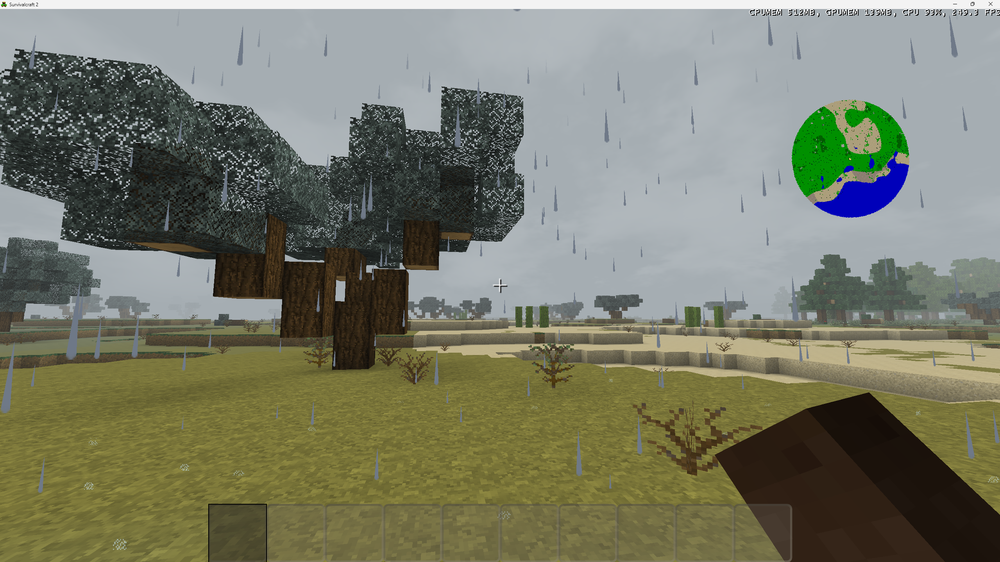
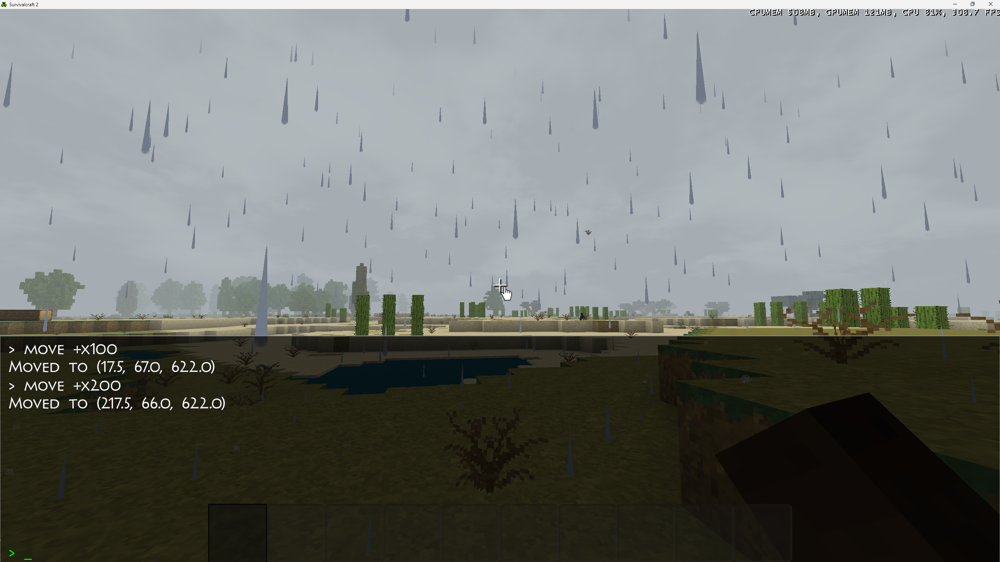

# SuAPI Example Mod Set

Survivalcraft 2 SuAPI Mod 示例集合。

## 同步控制

通过 `SYNC_LIST` 文件控制哪些 Mod 文件夹被 Git 同步：

```
# SYNC_LIST 格式：每行一个文件夹名
ConsoleMod
```

- 列出的文件夹 → 同步到仓库
- 未列出的文件夹 → 不同步
- 文件夹内的 `bin/`、`obj/`、`.vs/` 自动排除

**添加新 Mod 同步**：编辑 `SYNC_LIST`，添加文件夹名，然后运行：

```powershell
pwsh sync-gitignore.ps1
```

## 已收录 Mod

### SurvivalcraftMiniMap



小地图 Mod，通过新建 ComponentTemplate 向 Player 挂载地图组件，实时显示玩家位置和周围地形。

### ConsoleMod



游戏内控制台，按 `·` 打开，支持 `move +x300` 等指令移动角色，Widget Overlay 模式不暂停游戏。

### 其他 Mod

| Mod | 类型 | 说明 |
|-----|------|------|
| RainWithoutDawn | Subsystem 替换 | 替换天气系统，移除下雨逻辑 |
| TemperatureImmunity | Component 替换 | 替换体温组件，保持恒温 |
| Comms | 联机通信库 | SuAPI 联机 Mod 通信基础库 |
| ScMultiplayer | 联机 Mod | 复杂联机 Mod 示例 |

## 相关仓库

- SuAPI 核心：https://gitee.com/SC-SPM/survivalcraft-su-api

## AI Agent 技能

此仓库包含 AI Agent 技能配置 `SKILL.md`，可导入 QClaw/OpenClaw 获得示例集管理助手。
触发词：「添加示例」「同步到示例」「example mod set」。
