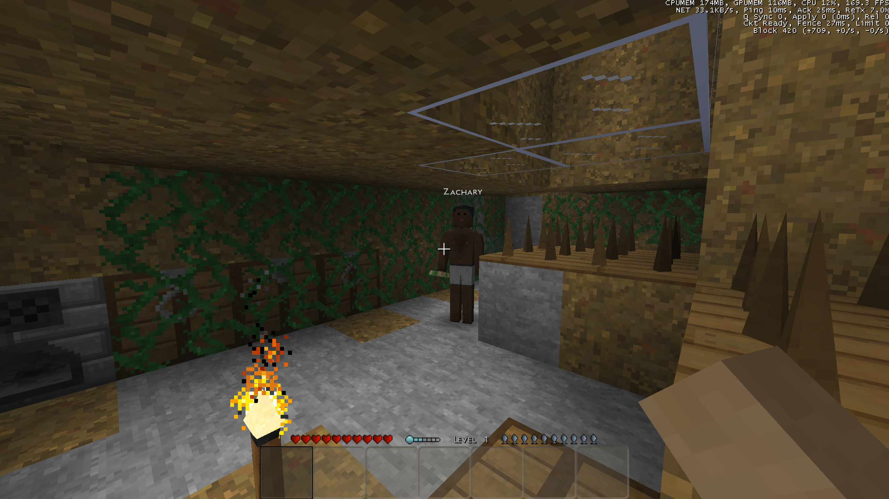
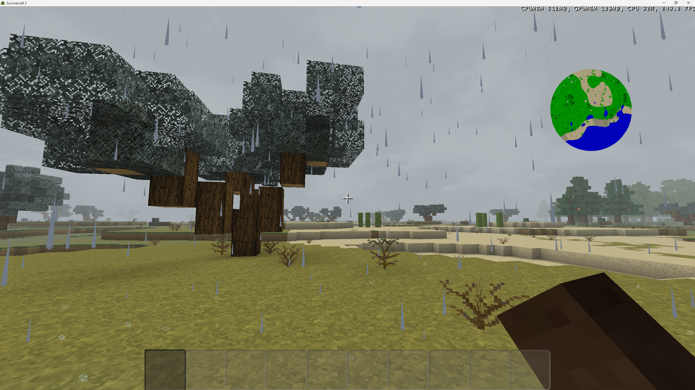
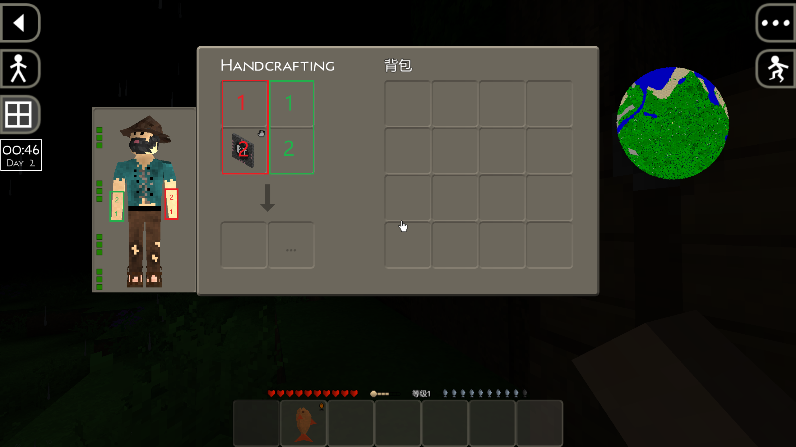
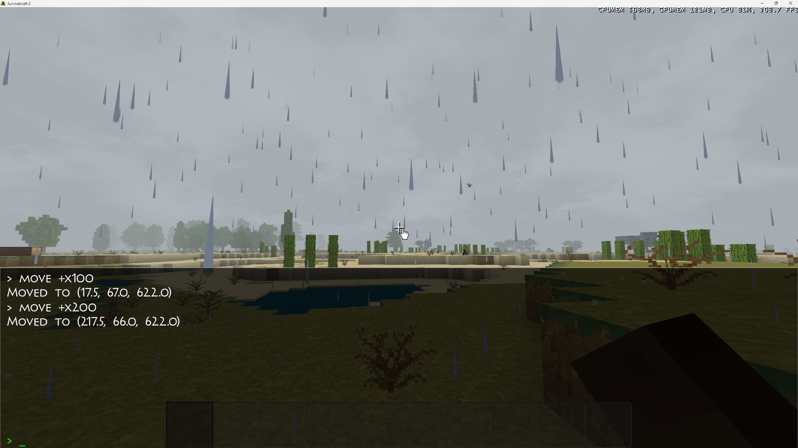
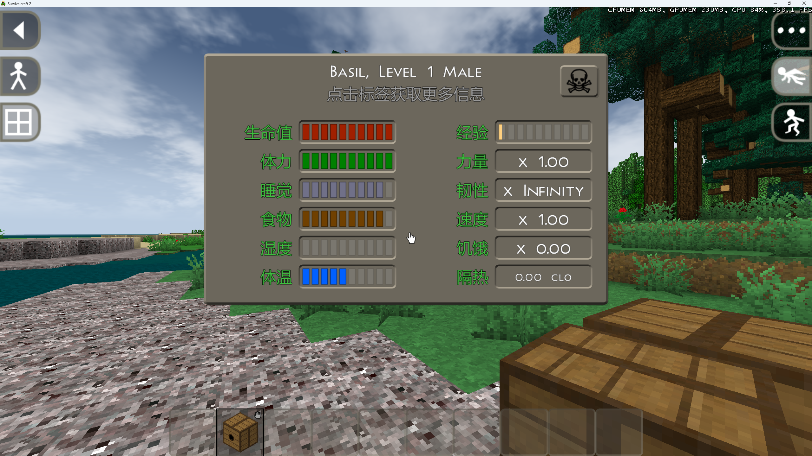
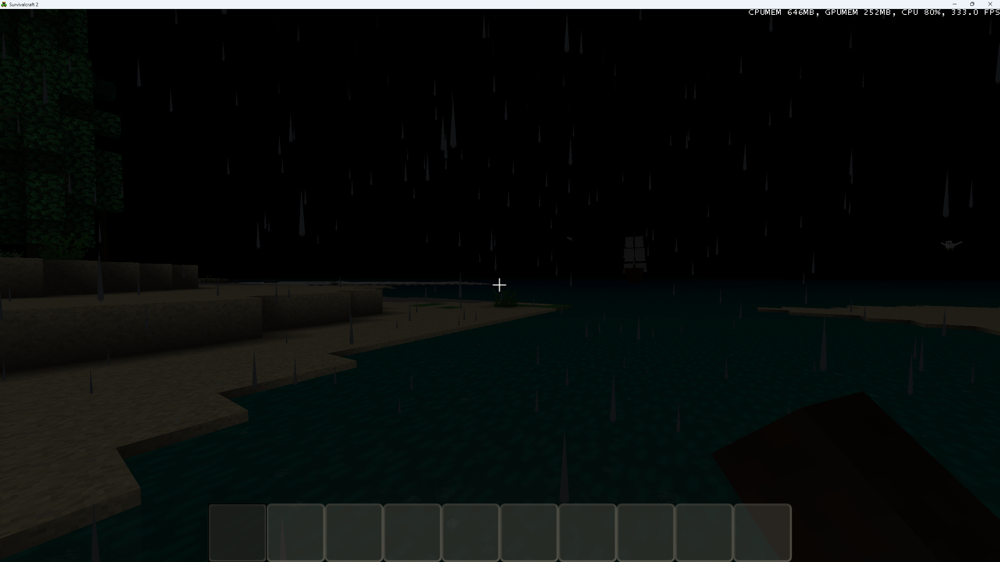
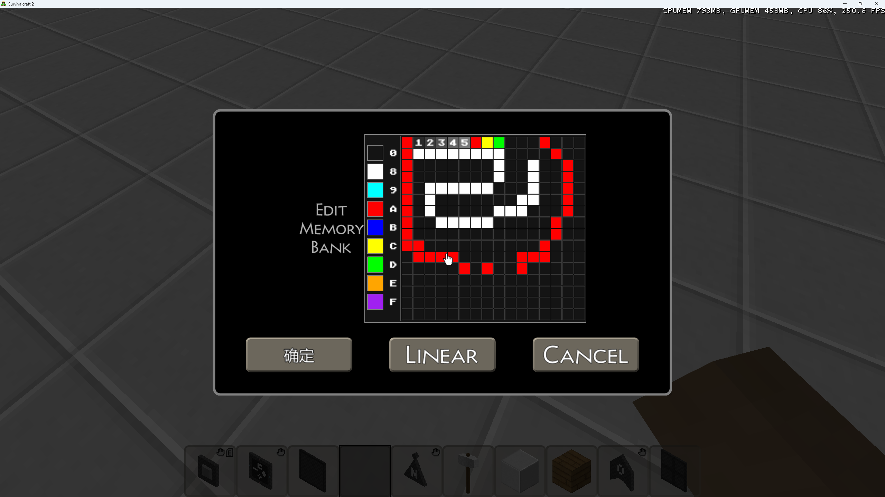

# SuAPI Example Mod Set

An example collection of Survivalcraft 2 SuAPI mods. The projects demonstrate how to extend the game through SuAPI without modifying the released game assemblies.

[中文 README](README.md)

## Project Features

- **.NET 8** - All mods use SDK-style projects targeting .NET 8.
- **SuAPI interfaces** - Uses `IModEventBus`, `IModInjector`, `IModParentField`, `IModParentMethod`, and `IModResource`.
- **Merge-library packages** - Normal mods use `IsMergeLib=true` and place assemblies directly under `Lib/`.
- **Python ZIP packaging** - `.scmod` packages are created with Python `zipfile` and use forward-slash paths.

## Build And Package

Build a mod from the repository root:

```bash
dotnet build Mod/<ModName>/<ModName>.csproj -c Debug --framework net8.0
```

For a merge-library package, the archive must contain `ModInfo.xml` at the root and the mod assembly under `Lib/`:

```python
import os
import zipfile

mod_dir = r"D:\path\to\Mod\YourMod"
output = r"D:\path\to\Mods\[SuAPI]YourMod.scmod"

with zipfile.ZipFile(output, "w", zipfile.ZIP_DEFLATED) as package:
    package.write(os.path.join(mod_dir, "ModInfo.xml"), "ModInfo.xml")
    package.write(
        os.path.join(mod_dir, "bin", "Debug", "net8.0", "YourMod.dll"),
        "Lib/YourMod.dll",
    )
```

Do not include `Engine.dll`, `Survivalcraft.dll`, `GameEntitySystem.dll`, or platform-specific `Lib/X64` and `Lib/Arm64` directories in a normal merge-library package. Windows and Android use the same platform-independent mod DLL.

## Included Mods

### ScMultiplayer



Current version: `2.1.1`
SuAPI compatibility: `0.1.5.0` / `0.1.5.1`
[Download Beta0.1.5.1](https://gitee.com/SC-SPM/su-api-example-mod-set/releases/tag/Beta0.1.5.1)

A host-authoritative multiplayer mod built on the Comms library. It synchronizes players, terrain, containers, dropped items, projectiles, animals, weather, circuits, sleep, and world time. It supports Windows and Android clients, headless servers, map transfer, reconnect recovery, and network diagnostics.

#### Update Summary: Beta0.1.3.4 To 2.1.1

The baseline is [`Beta0.1.3.4`](https://gitee.com/SC-SPM/su-api-example-mod-set/tree/Beta0.1.3.4) (`a7a36dc`, July 24, 2026). The previous 33-commit ScMultiplayer summary through `2.0.9` remains unchanged; three later commits completed join finalization, mount/boat synchronization, and host-authoritative sleep wake-up. The current release is `2.1.1` (`a10cdc5`, August 11, 2026).

- `1.9.x`: joining recovery, player and terrain synchronization, moving projectiles, circuit controls, world refresh, and authoritative knockback fixes.
- `2.0.0`: container drag-and-drop, item dropping and pickup, interaction synchronization, and multiplayer input handling.
- `2.0.7`: terrain interest ranges, batched recovery, reliable transport, and network diagnostics.
- `2.0.8`: modular multiplayer architecture plus sleep, circuit, terrain checkpoint, respawn, mount, and dispenser synchronization.
- `2.0.9`: host-authoritative dispenser execution, creation ordering, and multi-client container state fixes.
- `2.1.0`: reliable mount and dismount actions/states, host-side mount identity allocation, protection against stale position snapshots remounting a rider, join-time snapshots for existing boats, and delayed creation for boats outside the initial view range.
- `2.1.1`: host-authoritative non-manual wake-up while clients retain only sleep presentation and manual wake requests, with no client-side 20x world acceleration; sequence-correlated sleep requests prevent stale health snapshots from waking players early; vanilla per-player sleep start times and daylight wake rules are preserved, and player wake-up is decoupled from circuit recovery fences.

#### Commit-by-Commit History

| Date | Commit | Changes | Summary |
|------|--------|---------|---------|
| 2026-07-25 | [`5c910c4`](https://gitee.com/SC-SPM/su-api-example-mod-set/commit/5c910c4) | 1 file, +117/-21 | Recover circuit synchronization after joining. |
| 2026-07-25 | [`9a4de42`](https://gitee.com/SC-SPM/su-api-example-mod-set/commit/9a4de42) | 1 file, +1/-0 | Update the multiplayer server directory. |
| 2026-07-25 | [`0ae9728`](https://gitee.com/SC-SPM/su-api-example-mod-set/commit/0ae9728) | 1 file, +2/-1 | Update the multiplayer server directory again. |
| 2026-07-26 | [`e14889f`](https://gitee.com/SC-SPM/su-api-example-mod-set/commit/e14889f) | 9 files, +1503/-212 | Improve multiplayer synchronization reliability. |
| 2026-07-26 | [`4240f23`](https://gitee.com/SC-SPM/su-api-example-mod-set/commit/4240f23) | 6 files, +536/-203 | Stabilize discovery and background simulation. |
| 2026-07-26 | [`8ca035b`](https://gitee.com/SC-SPM/su-api-example-mod-set/commit/8ca035b) | 2 files, +80/-7 | Compensate moving projectile release offsets. |
| 2026-07-26 | [`9f0f522`](https://gitee.com/SC-SPM/su-api-example-mod-set/commit/9f0f522) | 7 files, +1044/-19 | Add persistent multiplayer world links. |
| 2026-07-26 | [`f0535fd`](https://gitee.com/SC-SPM/su-api-example-mod-set/commit/f0535fd) | 9 files, +641/-33 | Harden circuit and control synchronization. |
| 2026-07-26 | [`4d2441c`](https://gitee.com/SC-SPM/su-api-example-mod-set/commit/4d2441c) | 1 file, +1/-4 | Remove non-permanent server entries. |
| 2026-07-26 | [`a2a8d8f`](https://gitee.com/SC-SPM/su-api-example-mod-set/commit/a2a8d8f) | 6 files, +487/-82 | Stabilize world and player synchronization. |
| 2026-07-30 | [`bf18316`](https://gitee.com/SC-SPM/su-api-example-mod-set/commit/bf18316) | 7 files, +91/-324 | Release ScMultiplayer 1.9.1 and update headless tools. |
| 2026-07-30 | [`3d10824`](https://gitee.com/SC-SPM/su-api-example-mod-set/commit/3d10824) | 1 file, +42/-10 | Preserve the multiplayer refresh session. |
| 2026-07-31 | [`dad0ab4`](https://gitee.com/SC-SPM/su-api-example-mod-set/commit/dad0ab4) | 2 files, +195/-48 | Synchronize authoritative knockback and flight. |
| 2026-08-02 | [`c1b6b80`](https://gitee.com/SC-SPM/su-api-example-mod-set/commit/c1b6b80) | 2 files, +8/-7 | Update mod metadata and world controls. |
| 2026-08-03 | [`3a6784b`](https://gitee.com/SC-SPM/su-api-example-mod-set/commit/3a6784b) | 15 files, +2025/-247 | Fix terrain block placement replication. |
| 2026-08-04 | [`de30972`](https://gitee.com/SC-SPM/su-api-example-mod-set/commit/de30972) | 7 files, +1561/-106 | Release ScMultiplayer 1.9.4 and HeadlessRenderingMod 1.3.2. |
| 2026-08-04 | [`48794cb`](https://gitee.com/SC-SPM/su-api-example-mod-set/commit/48794cb) | 5 files, +13/-89 | Consolidate translation and font resources. |
| 2026-08-04 | [`4d4d77a`](https://gitee.com/SC-SPM/su-api-example-mod-set/commit/4d4d77a) | 2 files, +3/-3 | Update mods for SuAPI 0.1.5.0. |
| 2026-08-05 | [`fd99b2e`](https://gitee.com/SC-SPM/su-api-example-mod-set/commit/fd99b2e) | 18 files, +2691/-234 | Synchronize container drag-and-drop, drops, and interactions. |
| 2026-08-05 | [`218117f`](https://gitee.com/SC-SPM/su-api-example-mod-set/commit/218117f) | 3 files, +4/-4 | Release ScMultiplayer 2.0.0. |
| 2026-08-06 | [`1a30d2b`](https://gitee.com/SC-SPM/su-api-example-mod-set/commit/1a30d2b) | 17 files, +2891/-489 | Release ScMultiplayer 2.0.7 and update ModDns. |
| 2026-08-08 | [`233a97b`](https://gitee.com/SC-SPM/su-api-example-mod-set/commit/233a97b) | 95 files, +27008/-20383 | Modularize multiplayer code and stabilize joining, terrain, and networking. |
| 2026-08-08 | [`e1be835`](https://gitee.com/SC-SPM/su-api-example-mod-set/commit/e1be835) | 1 file, +1/-1 | Update ScMultiplayer to 2.0.8 in ModDns. |
| 2026-08-08 | [`f1b9f7d`](https://gitee.com/SC-SPM/su-api-example-mod-set/commit/f1b9f7d) | 1 file, +4/-4 | Add SuAPI 0.1.5.1 compatibility metadata. |
| 2026-08-08 | [`8e30e5d`](https://gitee.com/SC-SPM/su-api-example-mod-set/commit/8e30e5d) | 7 files, +156/-6 | Synchronize sleep wake-up with circuit recovery. |
| 2026-08-08 | [`18f5397`](https://gitee.com/SC-SPM/su-api-example-mod-set/commit/18f5397) | 8 files, +297/-31 | Stabilize circuit and sleep synchronization. |
| 2026-08-08 | [`7984e2a`](https://gitee.com/SC-SPM/su-api-example-mod-set/commit/7984e2a) | 5 files, +53/-6 | Wake clients after authoritative sleep acceleration. |
| 2026-08-09 | [`28eff36`](https://gitee.com/SC-SPM/su-api-example-mod-set/commit/28eff36) | 30 files, +2807/-1134 | Reconcile terrain checkpoints by client interest. |
| 2026-08-09 | [`98fd750`](https://gitee.com/SC-SPM/su-api-example-mod-set/commit/98fd750) | 11 files, +386/-24 | Preserve terrain revisions and respawn state. |
| 2026-08-09 | [`2c1eb59`](https://gitee.com/SC-SPM/su-api-example-mod-set/commit/2c1eb59) | 25 files, +1076/-73 | Synchronize remote mounts and make dispenser execution host-authoritative. |
| 2026-08-10 | [`c7b7adb`](https://gitee.com/SC-SPM/su-api-example-mod-set/commit/c7b7adb) | 1 file, +8/-1 | Keep dispenser effects authoritative on the host. |
| 2026-08-10 | [`7f9b7c7`](https://gitee.com/SC-SPM/su-api-example-mod-set/commit/7f9b7c7) | 1 file, +11/-0 | Queue dispenser actions after circuit element creation. |
| 2026-08-10 | [`d0859d8`](https://gitee.com/SC-SPM/su-api-example-mod-set/commit/d0859d8) | 4 files, +14/-54 | Release ScMultiplayer 2.0.9 and finish dispenser synchronization. |
| 2026-08-10 | [`516a1db`](https://gitee.com/SC-SPM/su-api-example-mod-set/commit/516a1db) | 3 files, +17/-10 | Remove the extra reliable-window gate from join completion to prevent clients remaining in Joining Room. |
| 2026-08-11 | [`6e45d62`](https://gitee.com/SC-SPM/su-api-example-mod-set/commit/6e45d62) | 16 files, +826/-51 | Release ScMultiplayer 2.1.0 with reliable mount actions/states, host mount ID allocation, existing-boat join snapshots, and delayed remote boat creation. |
| 2026-08-11 | [`a10cdc5`](https://gitee.com/SC-SPM/su-api-example-mod-set/commit/a10cdc5) | 13 files, +196/-102 | Release ScMultiplayer 2.1.1 with host-authoritative sleep wake-up, request sequence acknowledgement, vanilla sleep-time preservation, and circuit recovery decoupling. |

[View the complete Beta0.1.3.4 to current diff](https://gitee.com/SC-SPM/su-api-example-mod-set/compare/Beta0.1.3.4...master)

### SurvivalcraftMiniMap



A minimap mod that mounts a map component on the Player entity through ComponentTemplate and displays the player position and nearby terrain in real time.

### WatchMod



A watch mod using the ComponentTemplate + IUpdateable pattern. Placing a RealTimeClockBlock in handcrafting slot 2 displays the game time without replacing SubsystemGameWidgets.

### ConsoleMod



An in-game console opened with `·`, supporting commands such as `move +x300`. Windows uses KeyboardInput and Android uses `Keyboard.ShowKeyboard()`.

### TranslationMod



A Chinese translation mod using Widget tree interception and the IStringProcessor translation API.

### RainWithoutDawn



A subsystem replacement example that removes rain behavior.

### MemoryBankDrawMod



A Memory Bank drawing editor with a 16x16 Draw mode, 16-color palette, and drag-fill support.

### HeadlessRenderingMod

A headless Windows server mod that disables world and UI drawing and exposes a local TCP JSON control interface.

### Other Mods

| Mod | Type | Description |
|-----|------|-------------|
| TemperatureImmunity | Component replacement | Keeps the player temperature stable. |
| Comms | Multiplayer library | Communication foundation used by ScMultiplayer. |

## Resource Loading

Mods can use both resource-loading methods below.

### 1. `.scmod` Content Directory To ContentCache

Files under `Content/` are extracted and cached by ModLoader. The resource key removes the `Content/` prefix and file extension:

```text
Content/SuConsoleButton.png -> ContentCache.Get<Texture2D>("Mod/SuConsoleButton")
Content/Fonts/chinese12.png -> ContentCache.Get<Texture2D>("Mod/Fonts/chinese12")
Content/zh_CN.xml           -> ContentCache.Get<XElement>("Mod/zh_CN")
```

```csharp
using Engine.Content;

Texture2D texture = ContentCache.Get<Texture2D>("Mod/SuConsoleButton");
```

Package the resource with the same archive path:

```python
package.write("Content/SuConsoleButton.png", "Content/SuConsoleButton.png")
```

This method is suitable for textures, fonts, translation XML files, and models that users may replace without rebuilding the DLL.

### 2. Embedded DLL Resources

Resources can also be embedded into the mod assembly:

```xml
<ItemGroup>
  <EmbeddedResource Include="Content\YourButton_Pressed.png" />
</ItemGroup>
```

```csharp
using System.Reflection;

Stream stream = Assembly.GetExecutingAssembly()
    .GetManifestResourceStream("ConsoleMod.Content.YourButton_Pressed.png");
Texture2D texture = Texture2D.Load(stream);
stream.Dispose();
```

Embedded resources are appropriate for small assets that should always remain coupled to the DLL. A mod may use ContentCache for replaceable assets and embedded resources for fixed assets.

## Runtime Rules

1. **Mod dependency loading** - DLLs inside an `.scmod` package are not loaded automatically. ModLoader loads the assembly matching the mod identifier and assemblies declared in `<Dependencies>`.
2. **ReplaceItem names** - `LoadingManager.ReplaceItem(name, action)` must use the exact queue item name, such as `Initialize PlayScreen`, rather than a screen class name.
3. **EventBus exceptions** - Callback exceptions may only reach standard output, so inspect the relevant runtime output when a callback appears not to run.
4. **Android AOT and linker trimming** - Release builds can remove methods only used by mods. Avoid reflection-sensitive or trimming-sensitive patterns unless they are preserved explicitly.
5. **Coordinate system** - Survivalcraft screen Y coordinates increase upward. Keep visual radius, scale, and margins as separate layout parameters.
6. **Diagnostic logging** - Remove temporary diagnostic logs after verification and before committing.
7. **Storage paths** - `Storage.ProcessPath` accepts supported virtual path schemes such as `app:` and `data:` rather than arbitrary absolute paths.
8. **ZIP paths** - Create `.scmod` packages with Python `zipfile` and forward-slash archive paths.
9. **Root metadata** - `ModInfo.xml` must be at the archive root.
10. **Merge libraries** - Keep assemblies in flat `Lib/` and use `IsMergeLib=true`; do not create platform subdirectories.

## Related Repositories

- [SuAPI Core on Gitee](https://gitee.com/SC-SPM/survivalcraft-su-api)
- [SuAPI Example Mod Set on GitHub](https://github.com/SCAPI24/su-api-example-mod-set)
